

  

<h1 align="center">PoyrazK8s</h1>

  <strong>Kubernetes Security & Orchestration Workspace</strong>

  
  
  
  

---

## Strategic Advantage

**PoyrazK8s** is designed for organizations requiring deep visibility into Kubernetes infrastructures. Leveraging **eBPF (Extended Berkeley Packet Filter)**, **PoyrazK8s** delivers kernel-level observability , bridging the gap between infrastructure management and advanced threat detection.

---

## System Architecture

PoyrazK8s utilizes a high-performance, distributed architecture to ensure scalability across multi-node clusters.

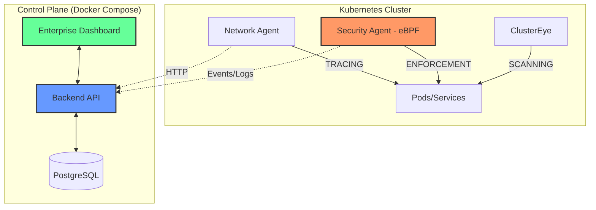

---

## Enterprise Capability Matrix

| Capability | Feature | Enterprise Value |
| :--- | :--- | :--- |
| **Observability** | Multi-Cluster Dashboard | Real-time health and resource visualization across the estate. |
| **Security** | eBPF Runtime Protection | Kernel-level detection of unauthorized executions and syscalls. |
| **Network** | L3/L4 Topology Mapping | Visual traffic flow analysis to identify bottlenecks and breaches. |
| **Governance** | RBAC Command Governance | Granular control over terminal access and command execution. |
| **App Creator** | Low-Code App Creator | Accelerated deployment via standardized enterprise templates. |
| **Compliance** | Automated Vulnerability Scanning | Security posture of images from designated registries is continuously assessed. |

---

## Feature Walkthrough

### Enterprise Dashboard & Multi-Cluster Overlook
Centrally manage and monitor your entire Kubernetes fleet. Gain immediate insights into cluster health, resource utilization, and critical events.

  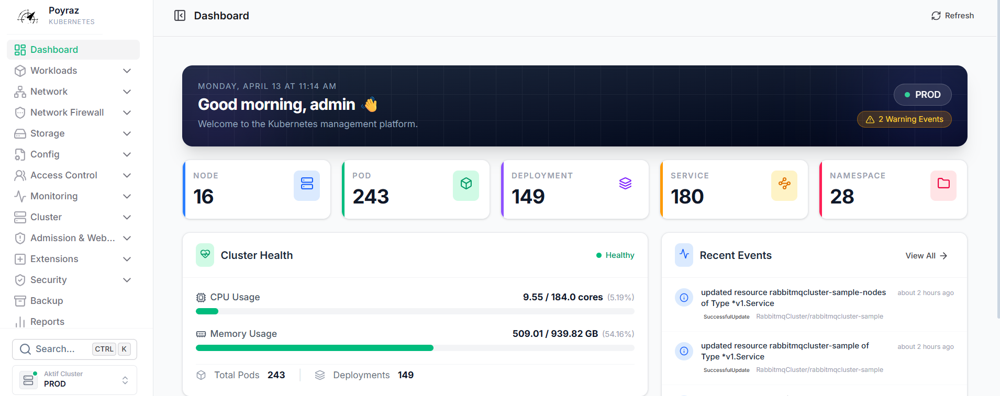

---

### App Creator: 8-Step Deployment Excellence
Our intuitive wizard simplifies complex deployments from Git-to-Cluster, ensuring standardized resource allocation and persistence.

#### The 8-Step Wizard Workflow

  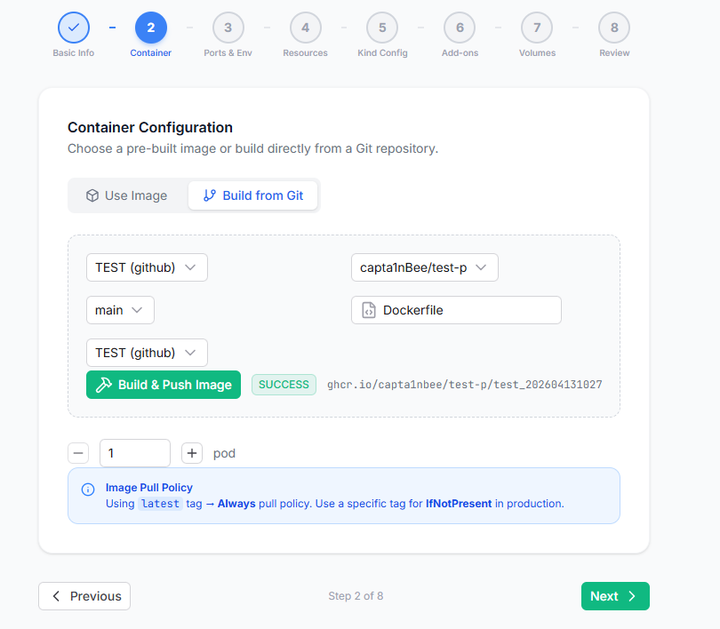 

**Key Capabilities:**
- **Build from Git:** Integrated CI/CD that builds images directly from your repository.
- **Helm Discovery:** Intelligent searching and deployment of Helm charts.
- **Yaml Backup Scheduler:** Full cluster resource persistence and recovery.

|  Helm Discovery | Backup Scheduler |
|:---:|:---:|
| 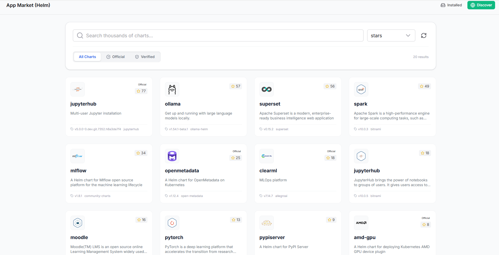 | 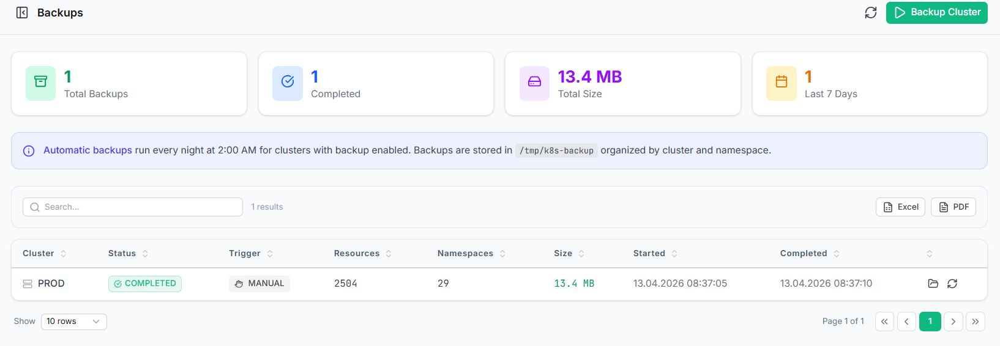 |

---

### Network Intelligence & Topology Forensics
Visualize your cluster's traffic flow and secure your perimeter with automated network policy generation and multi-cluster federation.

| Federation Management | Real-time Topology | Automated Firewall Rules |
|:---:|:---:|:---:|
| 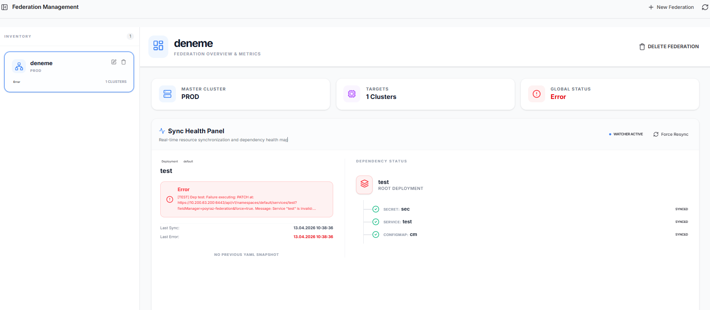 | 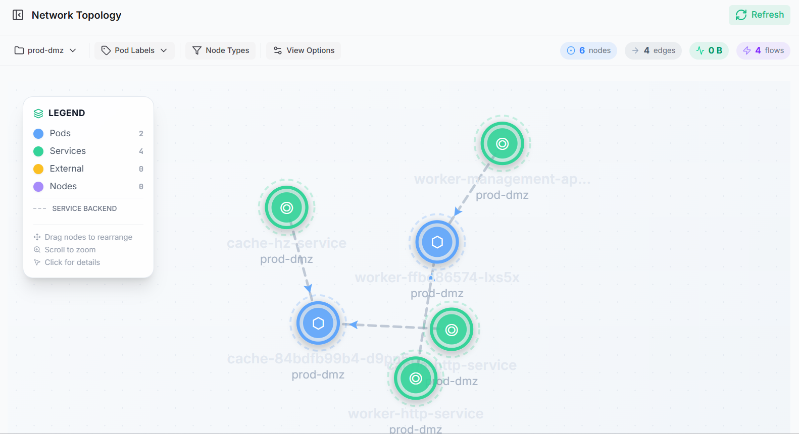 | 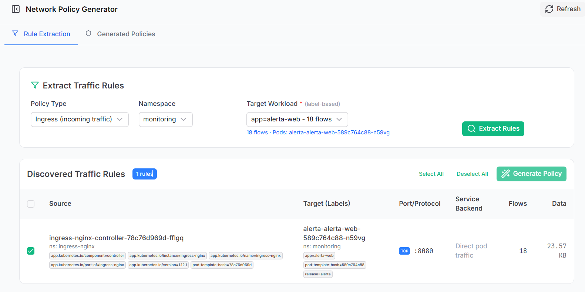 |

---

### RBAC Command Governance & Pod Session Record
Secure your runtime environment with kernel-level execution control and comprehensive session auditing.

| ClusterEye Security | Vulnerability Inventory | RBAC Command Governance |
|:---:|:---:|:---:|
| 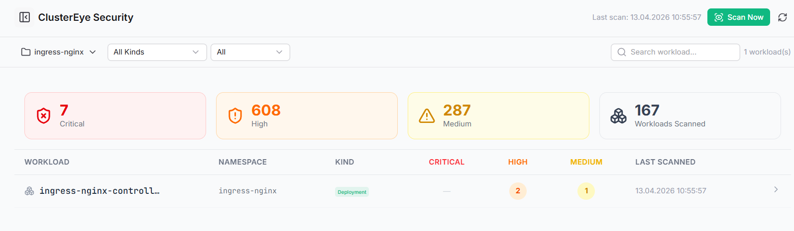 | 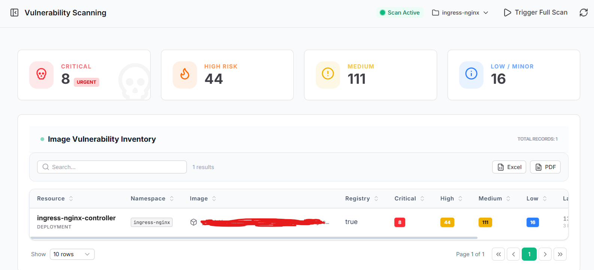 | 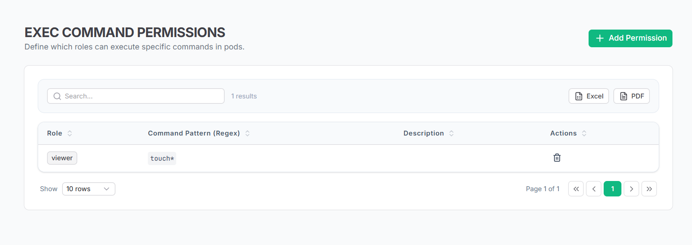 |

#### Pod Session Record Walkthrough
Detailed recording and auditing of all terminal interactions and automated command execution events.

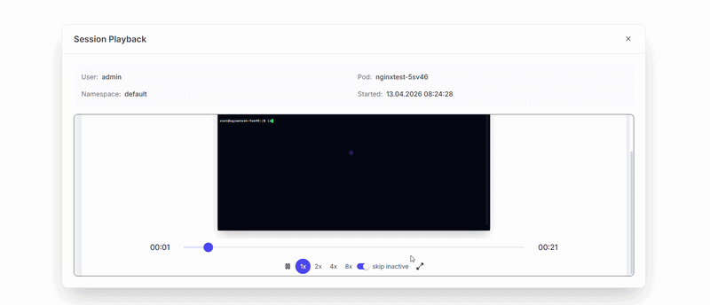

---
### Observability & Metric API Integration
### Detect and analyze objects dependent on ConfigMap & Secret modifications

---

## Strategic Roadmap

- [ ] **AI-Driven Infrastructure Baselining:** Machine-learning behavior modeling for alerting.
- [ ] **L7 Protocol Observability:** Deep-packet inspection 

---

## Getting Started

To begin your enterprise deployment of PoyrazK8s, please consult our comprehensive setup guide:

**[Launch Installation Guide](INSTALLATION.md)**

---

##  License & Support
PoyrazK8s is open-source software licensed under the **MIT License**.

  Developed with focus by <a href="https://github.com/capta1nBee"><strong>capta1nBee</strong></a>

